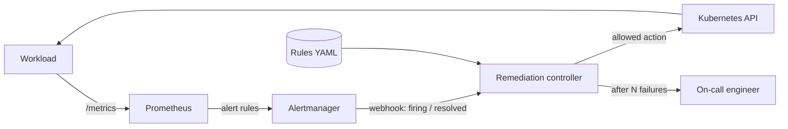

# Self-Healing Platform

**English** | [Русский](README.ru.md)

A lightweight event-driven remediation engine for Kubernetes:
**event → rule → action → verify → escalate.**

> Status: early development. The roadmap below shows what is done and what is planned.

## The idea

Most incidents an on-call engineer handles at night are routine: a pod stuck in a crash loop,
a disk filled with temporary files, a service that hangs until restarted. The fix is known and
written in a runbook — yet a human still has to wake up, read the alert and type the command.

This project automates such runbooks safely:

1. **Event** — Prometheus detects a problem, Alertmanager sends a webhook.
2. **Rule** — the controller matches the alert against declarative rules (YAML).
3. **Action** — it performs an allowed action through the Kubernetes API.
4. **Verify** — it waits for the alert to resolve and retries with backoff if it does not.
5. **Escalate** — after N failed attempts it stops and hands the incident to a human,
   with the full history of what was tried.



## Safety first

Automation that can do harm is worse than no automation. Guardrails are a core feature,
not an afterthought:

- **Allowlist** — only predefined actions, never arbitrary shell commands.
- **Dry-run** — log what would be done without doing it; the default for new rules.
- **Rate limits and blast radius** — at most N actions per hour, one action per object at a time.
- **Least privilege** — the controller's ServiceAccount gets only the RBAC rights its rules need.
- **Audit** — every decision and action goes to a structured log and to metrics.

## Rule example (draft)

```yaml
- name: restart-on-high-error-rate
  when:
    alertname: HighErrorRate
    severity: critical
  do:
    action: rollout_restart          # only actions from the allowlist
    target:
      kind: Deployment
      namespace: "{{ labels.namespace }}"
      name: "{{ labels.deployment }}"
  verify:
    resolved_within: 3m
  retry:
    max_attempts: 3
    backoff: 60s
  on_failure: escalate               # hand over to a human with full history
```

## Why not StackStorm, Robusta or Event-Driven Ansible?

They are mature, general-purpose tools, and this project borrows the same
"if event, then action" model. It explores a narrower niche: a single small service with
a closed remediation loop and guardrails built in, for small or air-gapped clusters where
a full automation platform is overkill or cannot be installed.

## Tech stack

| Area | Tools |
|---|---|
| Cluster | k3s, Helm |
| Observability | Prometheus, Alertmanager, Grafana, Loki, Alloy |
| Controller | Python (FastAPI, kubernetes client), SQLite; Go rewrite planned |
| Delivery | GitHub Actions, Trivy, GHCR, Argo CD |
| Infrastructure | OpenTofu, Ansible |
| Resilience testing | Chaos Mesh |

## Roadmap

- [ ] Repository skeleton and concept
- [ ] k3s cluster and first manual deployment
- [ ] Demo workload with metrics and fault-injection endpoints, packaged as a Helm chart
- [ ] Monitoring: kube-prometheus-stack, alert rules, dashboards
- [ ] Alertmanager webhook receiver
- [ ] Controller core: rules, deduplication by fingerprint, dry-run, Kubernetes actions, RBAC, state
- [ ] Closed loop: verification, backoff, rate limits, escalation to Telegram
- [ ] CI: lint, tests, image build, Trivy scan, publish to GHCR
- [ ] GitOps delivery with Argo CD
- [ ] Logs and controller audit in Loki
- [ ] Infrastructure as code: VMs with OpenTofu, k3s with Ansible
- [ ] Chaos experiments and MTTR measurements (before / after)
- [ ] Controller core in Go; AI-assisted triage (LLM suggests a runbook from the allowlist)
