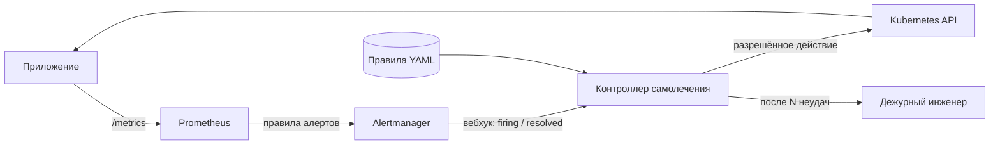

# Self-Healing Platform

[English](README.md) | **Русский**

Лёгкий движок событийного самолечения для Kubernetes:
**событие → правило → действие → проверка → эскалация.**

> Статус: ранняя разработка. Что сделано и что запланировано — в дорожной карте ниже.

## Идея

Большинство ночных инцидентов у дежурного — рутина: под застрял в цикле перезапусков,
диск забит временными файлами, сервис завис и оживает только после рестарта. Как это
исправить, известно и записано в runbook, — но человек всё равно должен проснуться,
прочитать алерт и набрать команду.

Проект автоматизирует такие runbook-и безопасно:

1. **Событие** — Prometheus замечает проблему, Alertmanager отправляет вебхук.
2. **Правило** — контроллер сопоставляет алерт с декларативными правилами (YAML).
3. **Действие** — выполняет разрешённое действие через Kubernetes API.
4. **Проверка** — ждёт, пока алерт перейдёт в resolved, и при неудаче повторяет с паузой.
5. **Эскалация** — после N неудачных попыток останавливается и передаёт инцидент
   человеку с полной историей того, что пробовали.



## Безопасность прежде всего

Автоматика, которая может навредить, хуже, чем её отсутствие. Предохранители — основная
часть проекта, а не дополнение:

- **Allowlist** — только заранее описанные действия, никакого произвольного shell.
- **Dry-run** — записать, что было бы сделано, ничего не делая; режим по умолчанию для новых правил.
- **Лимиты и радиус поражения** — не больше N действий в час, одно действие на объект за раз.
- **Минимальные права** — ServiceAccount контроллера получает через RBAC только то, что нужно его правилам.
- **Аудит** — каждое решение и действие пишется в структурированный лог и в метрики.

## Пример правила (черновик)

```yaml
- name: restart-on-high-error-rate
  when:
    alertname: HighErrorRate
    severity: critical
  do:
    action: rollout_restart          # только действия из allowlist
    target:
      kind: Deployment
      namespace: "{{ labels.namespace }}"
      name: "{{ labels.deployment }}"
  verify:
    resolved_within: 3m
  retry:
    max_attempts: 3
    backoff: 60s
  on_failure: escalate               # передать человеку с полной историей
```

## Почему не StackStorm, Robusta или Event-Driven Ansible?

Это зрелые универсальные инструменты, и проект заимствует ту же модель «если событие —
то действие». Он занимает более узкую нишу: один небольшой сервис с замкнутым циклом
лечения и встроенными предохранителями — для небольших или закрытых (air-gapped)
кластеров, где полноценная платформа автоматизации избыточна или не может быть установлена.

## Технологии

| Область | Инструменты |
|---|---|
| Кластер | k3s, Helm |
| Наблюдаемость | Prometheus, Alertmanager, Grafana, Loki, Alloy |
| Контроллер | Python (FastAPI, kubernetes client), SQLite; планируется версия на Go |
| Доставка | GitHub Actions, Trivy, GHCR, Argo CD |
| Инфраструктура | OpenTofu, Ansible |
| Проверка устойчивости | Chaos Mesh |

## Дорожная карта

- [ ] Каркас репозитория и концепция
- [ ] Кластер k3s и первый ручной деплой
- [ ] Демо-приложение с метриками и ручками для поломок, упакованное в Helm-чарт
- [ ] Мониторинг: kube-prometheus-stack, правила алертов, дашборды
- [ ] Приёмник вебхуков Alertmanager
- [ ] Ядро контроллера: правила, дедупликация по fingerprint, dry-run, действия в Kubernetes, RBAC, состояние
- [ ] Замкнутый цикл: проверка, backoff, лимиты, эскалация в Telegram
- [ ] CI: линтер, тесты, сборка образа, сканирование Trivy, публикация в GHCR
- [ ] GitOps-доставка через Argo CD
- [ ] Логи и аудит контроллера в Loki
- [ ] Инфраструктура как код: ВМ через OpenTofu, k3s через Ansible
- [ ] Хаос-эксперименты и замеры MTTR (до / после)
- [ ] Ядро контроллера на Go; AI-триаж (LLM предлагает runbook из allowlist)
